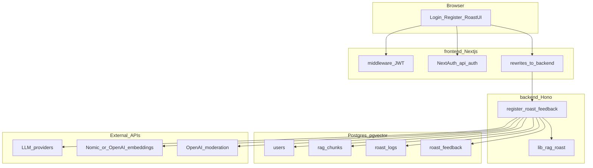
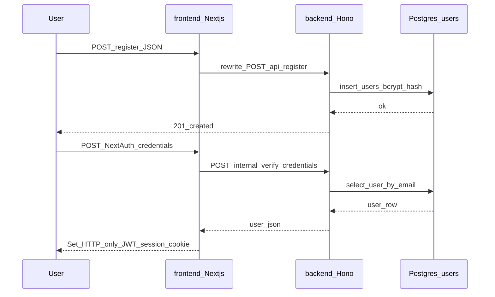
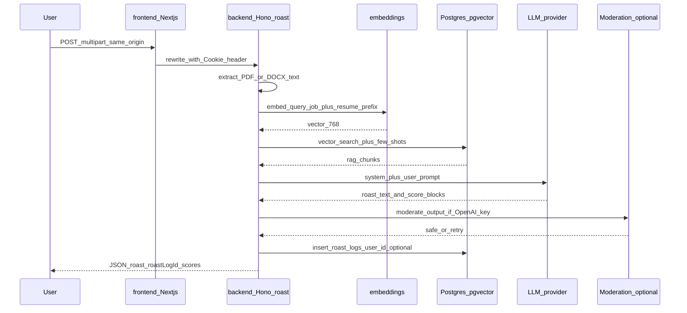

# Resume Roast — Milestone 2 architecture

**For Canvas:** Export this document to PDF (e.g. open in VS Code / GitHub preview → **Print → Save as PDF**, or use a “Markdown PDF” extension, or from this folder run Pandoc `pandoc milestone2-architecture.md -o architecture.pdf`).

## Overview

SER594-M2 is a **monorepo**: **`frontend/`** is a **Next.js 14** app (UI, NextAuth, `middleware.ts`); **`backend/`** is a **Hono** HTTP server (register, roast, feedback, RAG ingest, Drizzle, `lib/`). The browser calls **`http://localhost:3009`** only; Next.js **rewrites** proxy `/api/register`, `/api/roast`, and `/api/roast/feedback` to the backend so session cookies stay same-origin. **PostgreSQL** with **pgvector** stores RAG chunks, users, roast logs, and feedback. **External HTTP APIs** provide LLM inference, embeddings, and moderation.

## Layers

| Layer                  | Components                                                                                                                                                                            |
| ---------------------- | ------------------------------------------------------------------------------------------------------------------------------------------------------------------------------------- |
| Frontend (`frontend/`) | App Router: `/login`, `/register`, `/`; `SessionProvider`; `app/api/auth/*` (NextAuth); `middleware.ts` (JWT gate on `/`); rewrites to backend for roast/register/feedback            |
| Backend (`backend/`)   | Hono: `POST /api/register`, `POST /api/roast`, `POST /api/roast/feedback`, `POST /api/internal/verify-credentials`; `lib/`, `db/`, `drizzle/`, `rag/corpus/`, `scripts/rag-ingest.ts` |
| Data                   | Postgres: `users`, `rag_chunks` (+ vector index), `roast_logs`, `roast_feedback`                                                                                                      |
| External               | Groq / OpenAI / Anthropic (or custom OpenAI-compatible base URL); Nomic and/or OpenAI embeddings; OpenAI moderation when enabled                                                      |

## System context

## Auth data flow

## Roast and RAG pipeline (AI technique #1)

## External services and APIs

- **Groq** — OpenAI-compatible chat completions (`api.groq.com`).
- **OpenAI** — Chat completions; **text-embedding-3-small** for RAG query vectors; **Moderations** API for post-output safety when key present.
- **Anthropic** — Messages API for Claude models.
- **Custom** — Any OpenAI-compatible base URL (e.g. vLLM) via `CUSTOM_LLM_BASE_URL`.
- **Nomic Atlas** — Text embeddings (`NOMIC_API_KEY`) at 768 dimensions, aligned with `text-embedding-3-small` @ 768 in this app.

## Notes for graders

- **Vector store:** `rag_chunks.embedding` is `vector(768)` with an **HNSW** index (see `backend/drizzle/` migrations).
- **Ingestion:** From monorepo root, `npm run rag:ingest` runs in **backend** and reads `backend/rag/corpus/**` markdown, chunks, embeds, inserts rows.
- **Auth:** Email/password in `users`; sessions are **JWT** cookies via NextAuth on the **frontend**; home `/` requires a valid session (`frontend/middleware.ts`). Login checks credentials via **backend** internal route.
